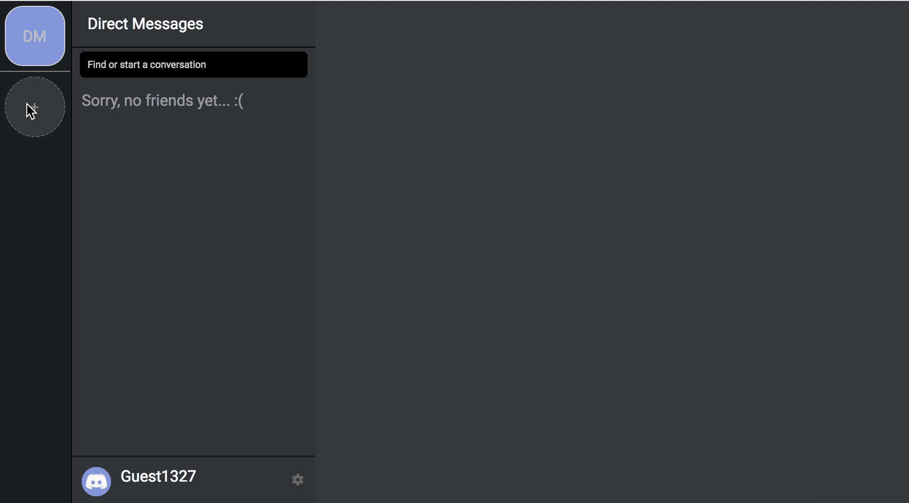
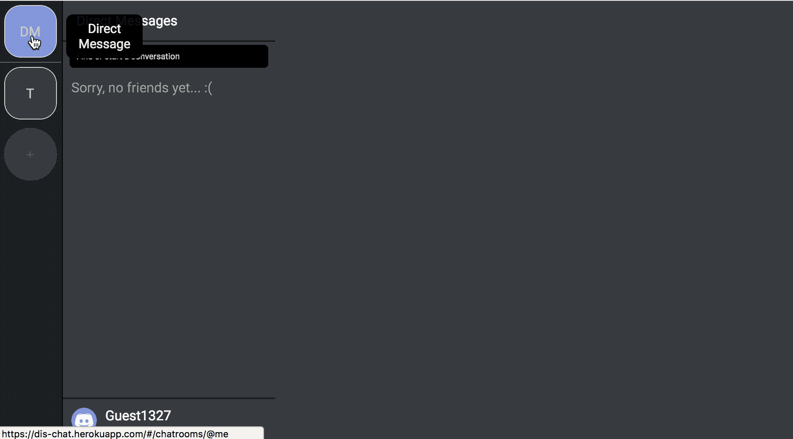
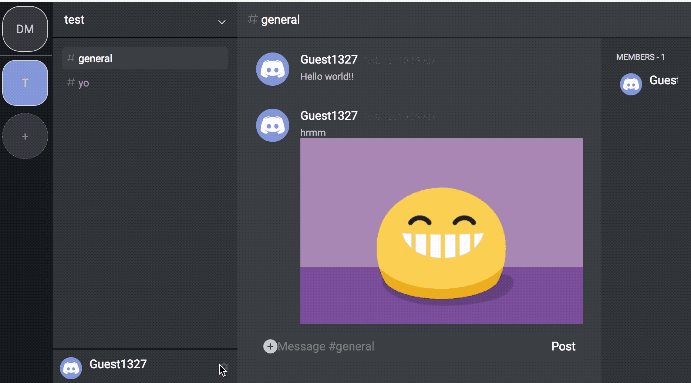

# Dischat - A Discord Clone

Dischat is a full-stack web application heavily inspired by Discord. It utilizes Ruby on Rails for the backend, a PostgreSQL database, and React+Redux used to manage the frontend.

- Personal note: It's one of my favorite chatting apps, so I thought it would be interesting to try and clone it.

## Overview

Dischat uses ruby on rails for to provide a JSON API, with the frontend being handled by Redux and React.

The  frontend is housed in the ```/frontend``` directory, which hooks into the static_pages#root html page provided in rails.


## Features and Implementation

#### Live Chat


Messages are stored at the database level, and are associated with a `user_id` and `channel_id`.

Images can be attached to messages, which are hosted on AWS S3 instances. Image processing is handled by rails.

Realtime updating is handled by Pusher, where a pusher instance is constructed on a per-channel basis. Pusher events provide message data in it's payload, which gets loaded into the redux state in real-time.

#### Attach Images to Messages


#### Create Chatrooms


Users can freely create chatrooms. Each chatroom can have many channels, it starts with a default `#general` channel

#### Join Chatrooms


Users can freely join chatrooms via chatroom ID.


#### Create + Edit Channels


Channels are where messaging takes place, a chatroom can have many channels.


#### Direct Messaging


DMs are private channels used to talk privately with others.


#### Update Profile Picture


Images are hosted on AWS


## Configuration

To configure this app, run ```npm install``` and ```bundle install``` for to install the relevant dependencies.

```npm run build``` will transpile the javascript files in ```/frontend``` to ```/app/assets/javascripts/bundle.js``` and ```/app/assets/javascripts/bundle.js.map```

Rails will include the bundle.js in the document when the server is running. You can run the server with ```rails start```.

All relevant API keys should be placed under ```/config/application.yml```. The Figaro rails gem is used to manage API keys.

[Pusher](http://pusher.com) is used for real-time updates, and AWS is used for to host uploaded images. Pusher config details should be placed under ```config/initializers/pusher.rb```

Paperclip (a rails gem) is used for save/retrieve images to AWS S3 bucket instances. Read the documentation on the rails ```aws-sdk``` gem if you wish to configure your keys properly. Paperclip preloads the aws-information in ```config/application.rb``` file.

## Database creation

The DB requires you to have postgresql installed and running.

DB creation is handled by rails via migrations, so you can run ```rails db:create``` and ```rails db:migrate``` to reproduce the DB structure.
